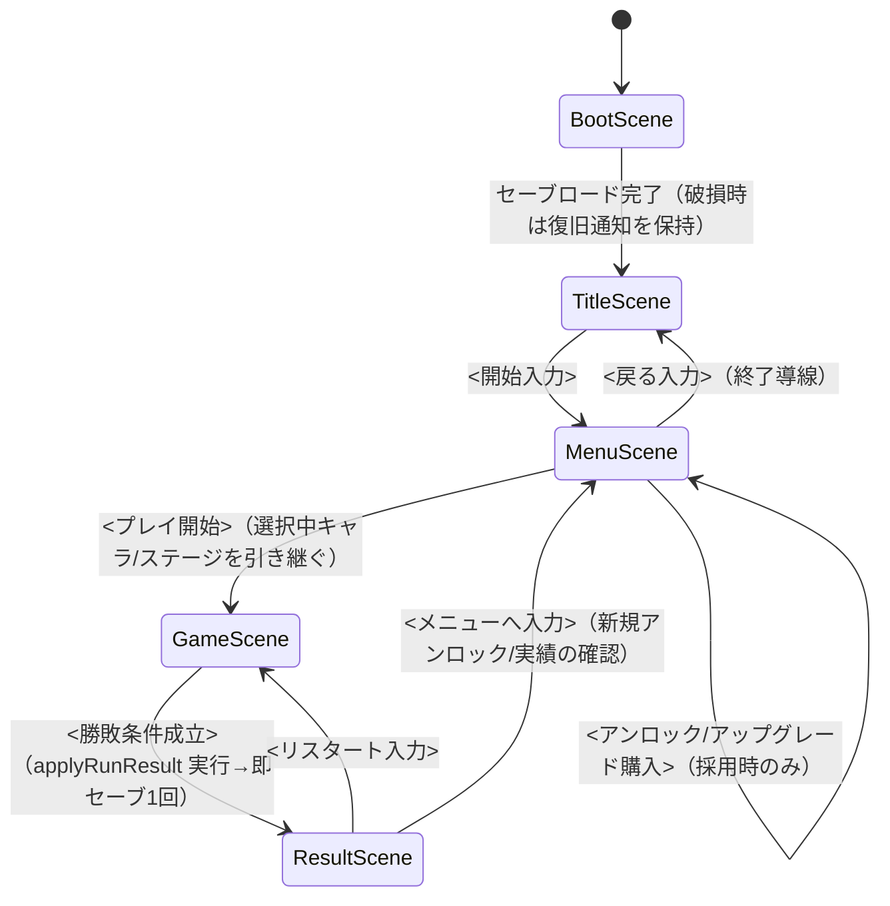

<!--
  テンプレート: design/gdd.md（出力先は contract.md §6 のこのパス固定）
  producer: game-designer / reviewer: design-reviewer（Gate: DR-GDD, MAX_ITER 3）
  役割: 実装の仕様書。stories.yaml への分解と、エンジン別 config 正本
  （phaser: game/src/config.ts / unity: GameConfig.cs / unreal: GameConfig.h — contract §11）の数値の正本
  執筆ルール: DR-GDD の6観点（concept整合 / 実装可能性 / 数値の具体性 / 完結性 / 矛盾スキャン /
  アウトゲーム完結性）に直接答える構造。全システムに P-xx 参照必須。数値は「後で決める」禁止＝初期値＋調整レンジで書く。
  必須シーン集合 Boot/Title/Menu/Game/Result とメタ進行節は省略不可（contract §11）。
  実装可能性の基準は選択エンジンの tech-stack 文書（state/engine.txt）。
  完成時にガイドコメントはすべて削除する。
-->

# GDD — <ゲームタイトル>

## システム一覧

<!-- コアループを構成するシステムを列挙。各行に必ず P-xx を1つ以上付ける
     （どのピラーにも寄与しないシステムは DR-GDD で削除提案される）。
     概要は「入力→処理→出力」が読み取れる1〜2文。
     Phaser 3 + TS で数時間の粒度を超えるシステムは分割するか out へ。 -->

| システム | P-xx | 概要 | 実装先の目安（systems/） |
|---|---|---|---|
| | | | |

## ゲームフロー

<!-- 必須シーン集合は Boot/Title/Menu/Game/Result の5状態（contract §11。省略不可）。名称はエンジン別:
     phaser = BootScene/TitleScene/MenuScene/GameScene/ResultScene（tech-stack.md）
     unity = Boot/Title/Menu/Game/Result の5シーン（tech-stack-unity.md）
     unreal = Maps/ のレベルまたは状態遷移で5状態を実装（tech-stack-unreal.md。省略不可）
     正準フロー: Boot→Title→Menu→Game→Result→{Game|Menu}。
     Menu の必須要素: プレイ開始 / アウトゲーム表示（アンロック・実績・統計）/ 設定（音量・操作表示）/ 終了導線。
     各遷移のトリガー（キー入力/条件成立）を明記。mermaid の状態遷移図推奨（以下は phaser 表記の例）。 -->

### Menu 必須要素チェック（contract §11。4要素すべての遷移/表示が上の図と実装に実在すること）

| 必須要素 | 対応する遷移/表示（上の mermaid・実装と一致させる） |
|---|---|
| プレイ開始 | |
| アウトゲーム表示（アンロック/実績/統計） | |
| 設定（音量・操作表示） | |
| 終了導線 | |

## 操作仕様

<!-- brief.md の操作を仕様レベルに落とす。押下/長押し/離した瞬間の区別、
     同時入力時の優先順位まで書く。入力は1モジュールに集約される前提（tech-stack.md 規約4）。 -->

| 入力 | 動作 | 補足（長押し/連打/優先度） |
|---|---|---|
| | | |

## 敵・障害物

<!-- 種別ごとに: 見た目の役割（assets.md の資産 id と対応させる）・行動パターン・
     当たり判定・出現条件。エンドレス型なら出現テーブル（時間帯×出現率）もここに。 -->

| 種別 | 行動パターン | 当たった時 | 出現条件 | 対応資産 id |
|---|---|---|---|---|
| | | | | |

## スコア・進行

<!-- 何をするとスコアが入るか（行為→点数）、倍率・コンボがあればその式、
     セッション内進行（距離/ウェーブ/レベル）の単位を定義。式は擬似コードで書いてよい。 -->

## 難易度曲線

<!-- 時間経過（またはスコア/距離）に対して何がどう変化するかを段階表で。
     brief.md のセッション長（例: 2〜3分）内に山場が来る設計かを自己点検する。 -->

| 経過（時間/距離/スコア） | 変化するパラメータ | 値の変化 |
|---|---|---|
| | | |

## 数値表

<!-- 全ゲームパラメータの正本。実装時はこの表がそのままエンジン別 config
     （phaser: src/config.ts / unity: GameConfig.cs / unreal: GameConfig.h）の
     名前付き定数になる（各 tech-stack 規約1: マジックナンバー禁止）。
     - 定数名: SCREAMING_SNAKE_CASE の英語（エンジン側イディオムへの写像は実装者が行う）
     - 初期値: 単位付き（phaser: px/s 等 / unity: m/s 等 / unreal: cm/s 等）
     - 調整レンジ: プレイテストで振ってよい下限〜上限。「後で決める」は DR-GDD で不合格
     - 根拠: なぜこの値か1句（例: 「画面横断に約2秒」） -->

| 定数名 | 意味 | 初期値 | 調整レンジ | 根拠 |
|---|---|---|---|---|
| | | | | |

## 勝敗条件

<!-- 勝利条件・敗北条件を判定式レベルで（例: 「HP <= 0 で敗北」「WAVE_MAX クリアで勝利」）。
     エンドレス型は「敗北のみ・ハイスコア記録」と明示。判定した瞬間の演出と遷移先も1文ずつ。 -->

## リスタート

<!-- 結果画面からの再挑戦手順（入力1回で GameScene へ戻れること）と、
     リセットされる状態/引き継ぐ状態（ハイスコア等）を列挙。
     リスタート不能・状態リークは QA-PLAY の重大バグ扱い。 -->

## メタ進行（アウトゲーム）

<!-- 必須節（DR-GDD 観点6 が判定。省略・空欄は不合格）。
     必須: ハイスコア/ベストタイム + 統計。追加で 通貨/アンロック/実績/持ち越しアップグレード
     から、ゲームジャンルに応じ 2つ以上 選択する（選択の合計が2未満は DR-GDD で CONCERNS。
     全採用はスコープ観点で削減提案対象）。
     - 通貨は消費先（アンロック/アップグレード）が無い場合、単独で1要素と数えない
       （「通貨+その消費先」で実質1経済系 — 独立して報酬体験を成立させる要素を2つ選ぶ）。
     - スコープ制約（DR-GDD 観点2）と衝突する場合も下限2は削らず、実装コスト最小の組
       （例: アンロック=既存資産の解放フラグのみ / 実績=判定式のみ）で満たす。
     各要素は必ず P-xx を参照する（rules/design-docs.md・contract §8 の規律と同一）。
     数値パラメータ（通貨・アップグレード、および解放条件/実績条件の式に含まれる閾値）は
     「初期値＋調整レンジ」必須（未確定値・形容詞のみの指定は DR-GDD で不合格）。
     実装先: ロジック=エンジン非依存コア層のサブフォルダ（phaser: src/systems/meta/ /
     unity: Assets/Scripts/Systems/Meta/ / unreal: Source/ForgeGame/Systems/Meta/）、
     永続化 I/O=永続化層（contract §11）。セーブ規約は contract §6。
     安定ID: 実績=ACH-xx / アンロック対象=UNL-xx / アップグレード=UPG-xx（contract §8）。 -->

### 採用要素

| 要素 | 採用（必須/選択-採用/選択-非採用） | P-xx | 根拠（1文） |
|---|---|---|---|
| ハイスコア / ベストタイム | 必須 | | |
| 統計 | 必須 | | |
| 通貨 | | | |
| アンロック | | | |
| 実績 | | | |
| 持ち越しアップグレード | | | |

### ハイスコア / ベストタイム

| 記録軸 | 集計方法（最高値/最短/累計等） | 表示先シーン |
|---|---|---|
| | | |

### 統計

| 統計項目 | 更新タイミング | 表示先 |
|---|---|---|
| | | |

### 通貨（採用時のみ）

| パラメータ | 初期値 | 調整レンジ | 根拠 | P-xx |
|---|---|---|---|---|
| ラン報酬レート | | | | |
| 初期所持額 | | | | |

### アンロック（採用時のみ）

<!-- 解放条件の式に含まれる数値閾値は「値（調整レンジ）」の形で書く（例: スコア >= 10000（8000〜15000））。 -->

| ID (UNL-xx) | 対象種別（キャラ/ステージ/スキン） | 解放条件（判定式・閾値は調整レンジ併記） | P-xx |
|---|---|---|---|
| | | | |

### 実績（採用時のみ）

<!-- 条件の式に含まれる数値閾値は「値（調整レンジ）」の形で書く。 -->

| ID (ACH-xx) | 条件（判定式・閾値は調整レンジ併記） | 進捗表示要否 | P-xx |
|---|---|---|---|
| | | | |

### 持ち越しアップグレード（採用時のみ）

| ID (UPG-xx) | 効果 | Lv初期値 | Lv上限 | 1Lvあたり増分（調整レンジ） | P-xx |
|---|---|---|---|---|---|
| | | | | | |

### セーブデータ方針

<!-- save_version・破損時挙動（.bak退避＋人間可視ログ＋黙って初期化しない）はエンジン共通仕様
     （contract §6 / 各 tech-stack 文書「セーブ / 永続化」）に従うため、ここではこのゲーム固有の
     保存対象キーと初回起動時（セーブ無し時）の初期状態のみ列挙する。 -->

| 保存対象 | SaveData のフィールド名 | 初期値（初回起動時） |
|---|---|---|
| | | |
