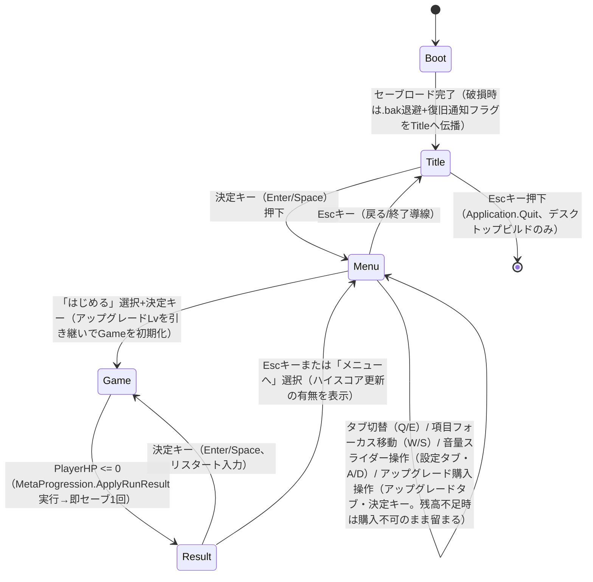

# GDD — Crystal Vanguard

## システム一覧

| システム | P-xx | 概要 | 実装先の目安（systems/） |
|---|---|---|---|
| プレイヤー移動 | P-01, P-02 | WASD/矢印の入力ベクトルを取得→アリーナ平面上の速度に変換→Transformを更新。攻撃入力が存在しないため移動操作だけに専念できる。 | `Assets/Scripts/Systems/PlayerMovement.cs`（pure C#）+ `Assets/Scripts/Components/PlayerController.cs`（配線） |
| ダッシュ回避 | P-01 | Space押下→方向優先順位（(1)同時押しの移動入力方向 (2)直前まで移動していた向き (3)いずれも無い場合のみ最寄り敵の反対方向）で短時間の高速移動を発行＋無敵フラグを立てる→クールダウンタイマーを管理（"正面"の基準は下記「操作仕様」ダッシュ行の決定を参照。ヒーローのfacingには連動させない）。 | `Assets/Scripts/Systems/DashSystem.cs` |
| 自動攻撃（照準ゼロ） | P-02, P-03 | 発動間隔タイマー満了→索敵範囲内で最も近い敵1体を検索→対象方向へ即座に向き直り→hero attackアニメ（ANM-01、1クリップ）を再生すると同時に瞬間ヒット（着弾までの飛翔時間なし）で単体ダメージを適用→ヒット位置にVFX/簡易パーティクル（当たり表現）を発生させる。プレイヤー入力は一切関与しない。 | `Assets/Scripts/Systems/AutoAttackSystem.cs` |
| 固定俯瞰カメラ | P-01 | Game開始時にアリーナ中心を注視する固定位置・角度をセット（プレイヤー追従なし）。四方から迫る敵を同時視認できる画角を常時維持する。 | `Assets/Scripts/Components/ArenaCameraRig.cs` |
| 敵接近AI | P-03 | 敵ごとにプレイヤー方向への単純な直線移動ベクトルを算出→速度を適用。接触判定でプレイヤーへダメージを発行。新規AI分岐を増やさず全敵種で共通ロジックを使う。 | `Assets/Scripts/Systems/EnemyApproachSystem.cs` |
| ウェーブスポーン＆難度カーブ | P-03 | 経過時間からウェーブ番号を算出→スポーン間隔/同時数/敵速度・HP倍率を導出→アリーナ外周のスポーンリング上に敵を生成する。 | `Assets/Scripts/Systems/WaveSpawnSystem.cs` |
| HP・被弾・死亡判定 | P-01, P-03 | ダメージイベントを受けてHPを減算→0以下で死亡イベントを発行。プレイヤーHPは敗北判定へ、敵HPは撃破・クリスタルドロップ処理へ連結する。 | `Assets/Scripts/Systems/HealthSystem.cs` |
| クリスタル ドロップ＆回収 | P-04 | 敵撃破位置にクリスタルを生成→プレイヤーが一定半径に入ると自動回収（拾得アクション不要）→ラン内カウンタとスコアに加算。 | `Assets/Scripts/Systems/CrystalSystem.cs` |
| スコア算出 | P-04 | 生存時間・撃破数・回収クリスタル数を集計式に適用→HUD表示用の現在スコアとResult用の最終スコアを算出する。 | `Assets/Scripts/Systems/ScoreSystem.cs` |
| HUD/フィードバック表示 | P-01, P-03 | HP・ダッシュクールダウン残・現在ウェーブ・現在スコアをGameシーンUIへ反映し、危機感と回避余力を常時把握できるようにする。ウェーブ番号が増加した瞬間はSFX（ウェーブ開始）を1回再生し、HUDウェーブ数値を0.3秒かけて1.0→1.3→1.0倍にスケールさせる短いパルス演出でウェーブ切替を明示する（「難易度曲線」節の決定を参照）。 | `Assets/Scripts/Ui/GameHud.cs` |
| メタ進行（アップグレード購入・永続化） | P-04 | Menuでのアップグレード購入操作→クリスタル残高から差し引き→Lv加算→SaveDataへ反映・永続化。Result到達時はRunResultをMetaProgressionへ渡し、ハイスコア/統計/クリスタル残高を更新する。 | `Assets/Scripts/Systems/Meta/MetaProgression.cs` + `Assets/Scripts/Persistence/FileSaveAdapter.cs` |

### 登場エンティティ対応資産 id（DR-GDD iteration 1 revise で追加。下流の assets.md 起票の突合先）

| エンティティ | モデル資産 id | アニメ資産 id | 備考 |
|---|---|---|---|
| ヒーロー（プレイヤー） | MDL-01（想定・design/assets.mdで確定） | ANM-01（attack）/ ANM-02（idle）/ ANM-03（run）（brief のhero 3クリップ予算と一致） | 自動攻撃当たり表現・死亡/被弾表現は下記サブ節の通りANM-01〜03の範囲内で完結させ、新規クリップは追加しない |
| スウォーマー（必須・敵） | MDL-02（想定・design/assets.mdで確定） | ANM-04（接近ループ、想定） | 敵・障害物節と同一 |
| ヘヴィスウォーマー（任意・敵） | MDL-03（想定・任意） | ANM-04を同一骨格なら共用、別骨格ならモデル差分のみで代用可 | 敵・障害物節と同一 |
| クリスタル | 該当なし（生成MDL不要。下記サブ節参照） | 該当なし（コードモーションのみ） | 撃破ドロップ→自動回収オブジェクト。エンジンプリミティブ＋発光マテリアルで構成 |
| アリーナ環境（地面／境界／スポーンリング表示） | 該当なし（生成MDL不要。下記サブ節参照） | 該当なし | 単一円形アリーナの地面・境界表現。エンジンプリミティブ＋マテリアルで構成 |

### クリスタル・アリーナ環境の視覚表現方針（決定・DR-GDD iteration 2 revise）

brief の3Dモデル上限は「hero 1・敵1〜2・プロップ1」の計4点。上表の通り hero=MDL-01（1点）、敵=MDL-02（必須）+MDL-03（任意）で最大3点を使用し、残る「プロップ1」枠は明示的に未使用のまま温存する。理由:

- **クリスタル**: brief アート方向で「幾何学形状」と指定されており、image-to-3D生成を要する有機的形状ではない。エンジン標準プリミティブ（八面体/多面体メッシュ）にエミッシブ（発光）マテリアルと緩やかな回転のコードモーションを組み合わせて表現し、生成MDLは使わない。プロップ枠を消費しない。
- **アリーナ環境**（地面・境界・スポーンリング）: 単一円形アリーナ1面のみで装飾密度を要さない（地面を無地〜簡易グラデーションに留めることは、敵/クリスタルのシルエット可読性を最優先するアート方向とも整合する）。地面は円柱/平面プリミティブ、スポーンリング位置はマテリアル上の同心円テクスチャまたは半透明リングメッシュで表現し、生成MDLは使わない。
- 結果としてbrief上限4点に対しGDDは最大3点（MDL-01/02/03）のみを使用し、プロップ1枠は未使用のまま据え置く（concept.mdスコープ節の「盛らない」方針と整合。将来装飾プロップを足す場合の温存枠として残す）。

### 自動攻撃の当たり表現方式（決定・DR-GDD iteration 1 revise）

brief で確保済みの hero アニメ予算（idle/run/attack の3クリップのみ）内で表現しきる必要があるため、方式を**瞬間ヒット＋VFX**に確定する（近接スイングの間合い調整・飛び道具の弾速/命中判定は追加のロジック・追加アニメを要するため不採用）。

- 発動間隔（`AUTO_ATTACK_INTERVAL`）満了時、対象方向へ瞬時に向き直り、hero attackアニメ（**ANM-01**、1クリップ・ループなし）を1回再生する
- ダメージは飛翔時間なしで即座に対象へ適用（弾道・命中判定オブジェクトを持たない）
- ヒット箇所に短命VFX（1種・design/assets.md で定義。既存の攻撃ヒットSFXと同期）を発生させ、単体ヒットでも「効いている」当たり手応えを補う
- 同一クリップで連続発動しても不自然にならないよう、アニメ長は `AUTO_ATTACK_INTERVAL` 初期値0.6sを超えない（超える場合は再生速度を発動間隔に合わせてスケーリングする）

## ゲームフロー



### Menu 画面構成（タブ構成・DR-GDD iteration 1 revise で追加）

Menu画面はタブバー形式で4タブを持つ: **はじめる／統計／アップグレード／設定**（この順に左から右へ配置し、**Q/E のみ**で循環切替。A/Dはタブ切替に割り当てない＝設定タブのスライダー調整との入力衝突を避けるため）。起動時の初期フォーカスは「はじめる」タブ。「統計」タブは表示専用（フォーカス移動なし）。「アップグレード」タブはUPG-01〜03の3項目をW/Sで縦フォーカスし決定キーで購入。「設定」タブはBGM/SFX音量スライダー2項目をW/Sで縦フォーカスしA/Dで値調整する（操作仕様表を参照）。

### Menu 必須要素チェック（contract §11。4要素すべての遷移/表示が上の図と実装に実在すること）

| 必須要素 | 対応する遷移/表示（上の mermaid・実装と一致させる） |
|---|---|
| プレイ開始 | Menu画面「はじめる」タブの項目→決定キーでGameへ遷移（アップグレードLv反映済みでGame初期化） |
| アウトゲーム表示（アンロック/実績/統計） | Menu画面の「統計」タブに、ハイスコア・ベスト生存時間・最高到達ウェーブ・累計プレイ回数/累計撃破数/累計獲得クリスタル・現在クリスタル残高・アップグレードLvを表示。「アップグレード」タブでUPG-01〜03の購入操作を行う。本作はアンロック/実績を非採用（「採用要素」表・根拠欄を参照） |
| 設定（音量・操作表示） | Menu画面の「設定」タブ：BGM音量/SFX音量スライダー（A/Dで調整、変更即時反映＋セーブ）、操作説明（WASD移動/Spaceダッシュ/攻撃は自動）の静的表示 |
| 終了導線 | Menu→Title（Escキー）。Title画面でさらにEscキーでApplication.Quit()（デスクトップビルドのみ） |

## 操作仕様

| 入力 | 動作 | 補足（長押し/連打/優先度） |
|---|---|---|
| W/A/S/D または矢印キー（Gameシーン） | アリーナ平面上を移動 | 長押しで継続移動。斜め入力はベクトル合成後に正規化しPLAYER_MOVE_SPEEDを超えない |
| Space（押下瞬間・Gameシーン） | ダッシュ回避を発動。方向優先順位: (1)同時押しの移動入力方向 (2)入力が無ければ直前まで移動していた向き (3)いずれも無い場合（ラン開始直後など一度も移動していない時）のみ最寄り敵（自動攻撃の対象）の反対方向 | クールダウン中は無反応（入力バッファなし）。ダッシュ中は移動入力を無視し軌道を固定。移動+Spaceの同時押しのみ許可（brief 操作仕様）。**"正面"の基準（決定・DR-GDD iteration 2 revise）**: 自動攻撃システムはヒーローの見た目の向き（facing）を最寄り敵方向へ常時回頭させるため、ダッシュ方向をfacingに連動させると静止ダッシュが敵へ突っ込む向きになりP-01（離脱/すり抜け）の意図と衝突しうる。よってダッシュ方向はfacingを参照せず、上記(1)〜(3)の移動ベースの優先順位のみで決定する。(3)が発動するのは移動未入力の初期状態に限られ、その場合は最寄り敵の反対方向へ離脱することで常に「その場を離れる」動きとして成立させる |
| （自動攻撃） | 入力なし。発動間隔タイマーで最寄りの敵1体へ自動発動 | P-02の中核。攻撃ボタンの割当自体が存在しない |
| W/S または矢印上下（Menuシーン） | 現在タブ内のメニュー項目（「はじめる」/アップグレード3項目/設定スライダー2項目）のフォーカス移動 | マウス不要。キーボードのみで完結（brief）。フォーカスは項目リストの先頭/末尾で止まる（ラップしない） |
| Q/E（Menuシーン） | タブ切替（「はじめる」／統計／アップグレード／設定の4タブを左右に循環） | タブ切替時はフォーカスをそのタブの先頭項目にリセット。統計タブは表示専用のためフォーカス移動なし（Q/Eでタブへ出入りのみ）。A/Dはタブ切替に割り当てない（下記スライダー入力との衝突回避） |
| Enter / Space（Menu/Title/Resultシーン） | 決定（プレイ開始・アップグレード購入・リスタート） | Resultシーンでは即座にGameへ遷移する専用のリスタート入力を兼ねる。設定タブのスライダー項目にフォーカス中は無効（スライダーはA/Dで調整するため決定操作を割り当てない） |
| A/D または矢印左右（Menuシーン・設定タブのスライダー項目フォーカス時） | フォーカス中のスライダー（BGM音量/SFX音量）を1段階（0.1刻み）増減 | 変更は即時反映＋即時セーブ（既存仕様）。スライダー項目フォーカス時のみ有効な入力で、タブ切替（Q/E）とはキーが異なるため衝突しない |
| Esc（Menuシーン） | 戻る（タブバー/項目にフォーカスがある状態からMenu→Titleへ） | 誤操作防止のため二重階層は持たない（Escは常にTitleへの単純遷移） |
| Esc（Titleシーン） | 終了導線（Title→アプリ終了） | Gameシーンでは未使用（誤操作によるラン中断を避ける） |

## 敵・障害物

| 種別 | 行動パターン | 当たった時 | 出現条件 | 対応資産 id |
|---|---|---|---|---|
| スウォーマー（必須） | 常にプレイヤー方向への直線移動（回避・迂回ロジックなし）。ENEMY_MOVE_SPEED_BASEを基準に、経過ウェーブに応じENEMY_SPEED_GROWTH_PER_WAVEずつ加速。 | PLAYER_COLLISION_RADIUS＋ENEMY_COLLISION_RADIUS以内に接触するとENEMY_CONTACT_COOLDOWN間隔でENEMY_CONTACT_DAMAGEをプレイヤーHPへ適用。自身はプレイヤーの自動攻撃でHPが0になるまで消滅しない。撃破時はCRYSTAL_DROP_PER_KILL_NORMAL個のクリスタルをその場にドロップし、SCORE_PER_KILL_NORMALを加点。 | ウェーブスポーンシステムがENEMY_SPAWN_RADIUS上のランダム点から、SPAWN_INTERVAL(wave)間隔でSPAWN_COUNT_PER_TICK(wave)体ずつ、MAX_CONCURRENT_ENEMIESを超えない範囲で継続生成。 | MDL-02（想定・design/assets.mdで確定）＋ ANM-04（接近ループ、想定） |
| ヘヴィスウォーマー（任意・見た目/ステータス差分のみ） | スウォーマーと同一の直線接近ロジックを再利用（新規AI分岐を追加しない。concept.md設計判断「敵種数の下限」に準拠）。HEAVY_ENEMY_SPEED_MULTで減速。 | 接触ダメージにHEAVY_ENEMY_CONTACT_DAMAGE_MULTを適用。最大HPにHEAVY_ENEMY_HP_MULTを適用。撃破時はCRYSTAL_DROP_PER_KILL_HEAVY個ドロップ＋SCORE_PER_KILL_HEAVYを加点。 | HEAVY_ENEMY_UNLOCK_WAVE以降、スポーン時にHEAVY_ENEMY_SPAWN_CHANCEの確率でスウォーマーの代わりに生成。実装余力が無ければ省略してよい任意要素（実装しない場合スウォーマーのみで成立させる）。 | MDL-03（想定・任意）＋ ANM-04を同一骨格なら共用、別骨格ならモデル差分のみで代用可 |

## スコア・進行

- 行為→点数（数値表「スコア・クリスタル」節が正本）:
  - 生存時間 1秒ごとに `SCORE_PER_SECOND_SURVIVED` を加点（毎フレームdeltaで積算）
  - 通常敵1体撃破ごとに `SCORE_PER_KILL_NORMAL` を加点、ヘヴィ変種は `SCORE_PER_KILL_HEAVY`
  - クリスタル1個回収ごとに `SCORE_PER_CRYSTAL` を加点（回収は自動。CRYSTAL_PICKUP_RADIUS節参照）
- 最終スコア算出（擬似コード。Result遷移時に確定）:

```
finalScore = floor(survivalTimeSec * SCORE_PER_SECOND_SURVIVED)
           + normalKillCount * SCORE_PER_KILL_NORMAL
           + heavyKillCount  * SCORE_PER_KILL_HEAVY
           + crystalsCollectedThisRun * SCORE_PER_CRYSTAL
```

- コンボ・倍率: 採用しない（P-02: 自動攻撃に手動操作を要求する仕組みを増やさない方針と整合させ、単純加算に留める）
- セッション内進行の単位: ウェーブ（Wave）。経過時間から算出する:

```
currentWave = 1 + floor(elapsedSec / WAVE_DURATION)
```

## 難易度曲線

brief のセッション長（2〜3分）を踏まえ、WAVE_DURATION=30sの初期値では120〜180秒でWave 5〜7相当に到達する（数値表「ウェーブ・難度カーブ」節の初期値で自己点検済み）。エンドレス型のため上限は設けず、ウェーブが進むほど指数的に圧力が高まり続ける。持ち越しアップグレードによるプレイヤー強化幅（UPG-01〜03。数値表「メタ進行・アップグレード」節）はスポーン増加ペースに対し相対的に小さく設計しており、アップグレードを積んでも難度曲線自体を頭打ちにはしない（concept.md「恒久アップグレードとセッション長の整合」の帰結。強くなるほど"どこまで先に進めるか"というP-04の意欲が継続する）。

**ウェーブ切替時のフィードバック（決定・DR-GDD iteration 2 revise）**: `currentWave`（`1 + floor(elapsedSec / WAVE_DURATION)`）の値が直前フレームから増加した瞬間、SFX（ウェーブ開始。brief 音要件の「ウェーブ開始」に対応し design/assets.md でSFX-xxとして採番）を1回再生し、HUDのウェーブ数値表示を0.3秒かけて1.0→1.3→1.0倍にスケールさせる短いパルス演出のみを行う（ゲームプレイの一時停止・専用VFX・専用3Dモデルは追加しない。実装先はHUD/フィードバック表示システムを参照）。

| 経過（ウェーブ） | 変化するパラメータ | 値の変化 |
|---|---|---|
| Wave 1（0〜30s） | スポーン間隔 / 同時スポーン数 / 敵速度 / 敵HP / ヘヴィ変種 | 1.5s / 1体 / 2.5 m/s / 40（基準） / 未出現 |
| Wave 3（60〜90s） | 同上 | 1.34s / 1体 / 2.70 m/s / 40（HP成長はWave4から） / 出現解禁（混入率15%） |
| Wave 5（120〜150s） | 同上 | 1.18s / 2体 / 2.92 m/s / 約45 / 混入率15% |
| Wave 8（210〜240s） | 同上 | 0.94s / 3体 / 3.29 m/s / 約54 / 混入率15% |
| Wave 12（330〜360s） | 同上 | 0.62s / 4体 / 3.85 m/s / 約68 / 混入率15% |
| Wave 16以降 | スポーン間隔 | SPAWN_INTERVAL_MIN（0.3s）で頭打ち。以降は同時数上限（MAX_CONCURRENT_ENEMIES）と速度/HP成長のみが圧力源になる |

## 数値表

自動攻撃ダメージ・移動速度・最大HPはメタ進行のアップグレードLvにより実行時に補正される（式は「メタ進行・アップグレード」節末尾を参照）。以下の初期値はLv0（アップグレード未購入）基準。

### プレイヤー

| 定数名 | 意味 | 初期値 | 調整レンジ | 根拠 |
|---|---|---|---|---|
| ARENA_RADIUS | アリーナ半径 | 12 m | 10–15 m | 固定俯瞰カメラで全景を収めやすく、移動速度で往復数秒に収まる規模 |
| PLAYER_MOVE_SPEED | プレイヤー移動速度（Lv0） | 6.0 m/s | 5.0–7.5 m/s | アリーナ直径(24m)を約4秒で横断。回避の逃げ足として妥当な速さ |
| PLAYER_COLLISION_RADIUS | プレイヤー当たり判定半径 | 0.4 m | 0.3–0.6 m | 敵接触判定・アリーナ境界クランプに使用 |
| PLAYER_MAX_HP_BASE | プレイヤー最大HP（Lv0） | 100 | 80–120 | 敵接触ダメージ(10前後)を10発前後耐えられる基準 |
| DASH_SPEED | ダッシュ中の移動速度 | 20 m/s | 16–25 m/s | 通常移動の3倍超で「一瞬で抜ける」感覚を作る |
| DASH_DURATION | ダッシュ継続時間 | 0.2 s | 0.15–0.3 s | 移動距離 ≈ DASH_SPEED×DASH_DURATION ≈ 4m（3〜6m相当） |
| DASH_COOLDOWN | ダッシュ再使用までの時間 | 1.2 s | 0.8–1.8 s | 連発による無敵時間の実質常時化を防ぐ（P-01: 際どさの担保） |
| DASH_INVULN_DURATION | ダッシュ無敵時間 | 0.25 s | 0.2–0.35 s | ダッシュ動作とほぼ同期させ「その瞬間だけ躱せる」窓にする |
| AUTO_ATTACK_RANGE | 自動攻撃の索敵半径 | 6 m | 5–8 m | 密集地帯でも常に最寄り1体を捉えられる範囲 |
| AUTO_ATTACK_INTERVAL | 自動攻撃の発動間隔 | 0.6 s | 0.4–0.9 s | 単体DPSを群れ増加ペースより低く抑える調整弁（concept.md「最大設計リスク」） |
| AUTO_ATTACK_DAMAGE_BASE | 自動攻撃ダメージ（Lv0） | 20 | 15–30 | 敵HP40に対し2発で撃破（TTK約1.2秒） |

### 敵

| 定数名 | 意味 | 初期値 | 調整レンジ | 根拠 |
|---|---|---|---|---|
| ENEMY_MOVE_SPEED_BASE | 敵（スウォーマー）移動速度基準 | 2.5 m/s | 2.0–3.5 m/s | プレイヤーより遅く追いつけないが、群れで包囲される脅威は残す |
| ENEMY_HP_BASE | 敵（スウォーマー）HP基準 | 40 | 30–60 | 自動攻撃2発で撃破される手応え |
| ENEMY_CONTACT_DAMAGE | 敵接触ダメージ | 10 | 8–15 | HP100に対し約10発耐性、複数同時接触で一気に脅威化 |
| ENEMY_CONTACT_COOLDOWN | 同一敵からの連続被弾間隔 | 0.5 s | 0.4–0.8 s | 接触し続けた際の秒間最大被ダメージを制御 |
| ENEMY_COLLISION_RADIUS | 敵当たり判定半径 | 0.5 m | 0.4–0.7 m | 接触判定・密集時の視覚混雑度に影響 |
| ENEMY_SPAWN_RADIUS | 敵スポーンリング半径 | 13.5 m | 12–17 m | ARENA_RADIUS超（初期値+1.5m）。出現直後は視認できるが接触まで移動猶予がある距離 |
| HEAVY_ENEMY_HP_MULT | ヘヴィ変種のHP倍率（任意採用時） | ×2.5 | ×2.0–3.0 | 見た目/ステータス差分のみで新規AIを追加しない（P-03設計判断） |
| HEAVY_ENEMY_SPEED_MULT | ヘヴィ変種の速度倍率 | ×0.6 | ×0.5–0.7 | 低速だが高HP・高ダメージという棲み分け |
| HEAVY_ENEMY_CONTACT_DAMAGE_MULT | ヘヴィ変種の接触ダメージ倍率 | ×1.5 | ×1.3–2.0 | 接触時の脅威度を明確に上げる |
| HEAVY_ENEMY_UNLOCK_WAVE | ヘヴィ変種の初出ウェーブ | 3 | 2–4 | 序盤は基本敵のみで学習させ、中盤から変化を加える |
| HEAVY_ENEMY_SPAWN_CHANCE | スポーン時のヘヴィ変種混入率 | 15% | 10–25% | 主流は通常敵のまま、稀に高脅威が混じる程度に抑える |

### ウェーブ・難度カーブ

| 定数名 | 意味 | 初期値 | 調整レンジ | 根拠 |
|---|---|---|---|---|
| WAVE_DURATION | 1ウェーブの長さ | 30 s | 20–40 s | 2〜3分セッションで4〜6ウェーブ相当の山場を作る |
| SPAWN_INTERVAL_BASE | スポーン間隔初期値（Wave1） | 1.5 s | 1.0–2.0 s | 開幕は避けの練習ができる余裕を残す |
| SPAWN_INTERVAL_DECAY_PER_WAVE | ウェーブ毎のスポーン間隔短縮量 | -0.08 s | -0.05〜-0.12 s | ウェーブが進むほど密度が上がる主要な圧力源（P-03） |
| SPAWN_INTERVAL_MIN | スポーン間隔下限 | 0.3 s | 0.2–0.4 s | 際限ない加速を防ぎ、パフォーマンス上限と整合 |
| SPAWN_COUNT_PER_TICK_BASE | 1回のスポーンで生成する同時数（Wave1基準） | 1 | 1–2 | 序盤の同時発生数 |
| SPAWN_COUNT_GROWTH_INTERVAL | 同時スポーン数が+1されるウェーブ間隔 | 3 waves | 2–4 waves | 物量増加のペース制御 |
| MAX_CONCURRENT_ENEMIES | 同時出現数の上限 | 40 | 30–60 | 密集の限界を定め、パフォーマンスと視認性を担保 |
| ENEMY_SPEED_GROWTH_PER_WAVE | 敵速度のウェーブ毎乗算成長率 | +4% | +3–6% | 逃げ場を狭める緊張の上昇（P-03） |
| ENEMY_HP_GROWTH_PER_WAVE | 敵HPのウェーブ毎乗算成長率（Wave4以降適用） | +6% | +4–8% | 序盤のTTKを壊さず後半だけ削りにくくする |

### スコア・クリスタル

| 定数名 | 意味 | 初期値 | 調整レンジ | 根拠 |
|---|---|---|---|---|
| SCORE_PER_SECOND_SURVIVED | 生存1秒あたりのスコア | 10 | 8–15 | 生存そのものを評価する基礎点 |
| SCORE_PER_KILL_NORMAL | 通常敵1体撃破のスコア | 25 | 15–40 | 撃破行為への直接的な報酬 |
| SCORE_PER_KILL_HEAVY | ヘヴィ変種1体撃破のスコア | 60 | 40–80 | 高脅威撃破への上乗せ評価 |
| SCORE_PER_CRYSTAL | クリスタル1個獲得あたりのスコア | 5 | 3–8 | 収集行動もスコアに反映 |
| CRYSTAL_DROP_PER_KILL_NORMAL | 通常敵撃破時のクリスタルドロップ数 | 1 | 1–2 | 基本の通貨獲得ペース |
| CRYSTAL_DROP_PER_KILL_HEAVY | ヘヴィ変種撃破時のクリスタルドロップ数 | 3 | 2–5 | 高脅威撃破への通貨インセンティブ |
| CRYSTAL_PICKUP_RADIUS | クリスタル自動回収半径 | 1.5 m | 1.0–2.0 m | 拾得操作を要求しない（P-02: 照準ゼロの思想を回収にも適用） |
| CRYSTAL_LIFETIME | クリスタル未回収時の消滅までの時間 | 8 s | 6–12 s | 際限ない残留によるフィールド混雑・処理負荷を防ぐ |

### メタ進行・アップグレード

| 定数名 | 意味 | 初期値 | 調整レンジ | 根拠 |
|---|---|---|---|---|
| UPGRADE_COST_BASE | アップグレードLv1購入コスト | 50 crystal | 30–80 | 最初の1〜2ラン分の稼ぎで届く到達感 |
| UPGRADE_COST_GROWTH_PER_LEVEL | Lv毎のコスト乗算成長率 | ×1.5 | ×1.3–1.8 | 上位Lvほど複数ラン分の投資を要求する |
| UPG_ATTACK_LEVEL_MAX | 攻撃力アップグレード上限Lv | 5 | 4–6 | P-02の強さを段階的に積み増す上限 |
| UPG_ATTACK_BONUS_PER_LEVEL | 攻撃力アップグレード1Lvあたりの増分 | +10% | +8–15% | AUTO_ATTACK_DAMAGE_BASEへの乗算加算 |
| UPG_MOVE_SPEED_LEVEL_MAX | 移動速度アップグレード上限Lv | 5 | 4–6 | 過剰な速度インフレを避ける上限 |
| UPG_MOVE_SPEED_BONUS_PER_LEVEL | 移動速度アップグレード1Lvあたりの増分 | +4% | +3–6% | PLAYER_MOVE_SPEEDへの乗算加算 |
| UPG_MAX_HP_LEVEL_MAX | 最大HPアップグレード上限Lv | 5 | 4–6 | 耐久力インフレの上限 |
| UPG_MAX_HP_BONUS_PER_LEVEL | 最大HPアップグレード1Lvあたりの増分 | +10 HP | +8–15 HP | PLAYER_MAX_HP_BASEへの加算 |

実行時の補正式（擬似コード。Game初期化時にセーブ済みLvから算出）:

```
effectiveAttackDamage = AUTO_ATTACK_DAMAGE_BASE * (1 + UPG_ATTACK_BONUS_PER_LEVEL * upgradeAttackLevel)
effectiveMoveSpeed    = PLAYER_MOVE_SPEED       * (1 + UPG_MOVE_SPEED_BONUS_PER_LEVEL * upgradeMoveSpeedLevel)
effectiveMaxHp        = PLAYER_MAX_HP_BASE      + UPG_MAX_HP_BONUS_PER_LEVEL * upgradeMaxHpLevel
upgradeCost(level)    = round(UPGRADE_COST_BASE * UPGRADE_COST_GROWTH_PER_LEVEL ^ (level - 1))
```

### カメラ

| 定数名 | 意味 | 初期値 | 調整レンジ | 根拠 |
|---|---|---|---|---|
| CAMERA_PITCH_DEG | カメラ見下ろし角 | 60°（Phase 3 Polish revise: 65°から変更） | 60–70° | concept.mdの固定俯瞰仕様（60〜70度）と一致。レンジ下限が南側可視限界を最大化する値（下記「南側可視性の再点検」参照） |
| CAMERA_HEIGHT | カメラ高さ（アリーナ中心からの垂直距離） | 18 m（Phase 3 Polish revise: 14mから変更） | 12–18 m | ARENA_RADIUS＋ENEMY_SPAWN_RADIUS全体を画角内に収めることを狙うが、レンジ上限でも南側は未達（下記参照）。レンジ内で南側可視限界を最大化する値 |
| CAMERA_FOV | カメラ画角（垂直FOV） | 55°（Phase 3 Polish revise: 50°から変更） | 45–55° | 高さ・ピッチと合わせてアリーナ全景を常時収める。レンジ内で南側可視限界を最大化する値 |

**南側可視性の再点検（決定・Phase 3 Polish revise、game-designer）**: `ArenaCameraMath.ComputeFixedPose` の幾何（カメラはアリーナ中心から南（-Z）側 `H/tan(P)` の位置に固定配置され、南側の可視限界は `-H/tan(P) + H/tan(P + FOV/2)`）に基づき算出すると、旧初期値（H=14/P=65°/F=50°）の南側可視限界は z≈-6.5m しかなく、S-20 の CR-CODE レビューで「四方の敵を同時視認できる可読性」acceptance が南側で未充足と判定された（state/reviews/s-20.md）。本節の初期値をレンジ内で南側可視限界が最も深くなる組み合わせ（H=18m・P=60°・F=55°＝いずれもレンジの境界値）に更新し、南側可視限界を z≈-9.6m まで拡大した（約+3m/+47%改善）。

ただし、この組み合わせでもレンジの物理的限界により **ARENA_RADIUS（12m）南端やENEMY_SPAWN_RADIUS（13.5m）の南側スポーン地点を完全にはカバーしない**（z≈-9.6mが限界）。四方を完全に均等カバーするにはレンジ自体の拡張（H>18mまたはF>55°。カメラ画角がアート構図・key imageに影響するため art-director との協議が必要）を要し、Phase 3 Polish のスコープ（config値変更のみで完結する調整）を超えるため今回は見送る。残存する制約は Checkpoint C への申し送り事項として維持する（S-22 参照）。

## 勝敗条件

- 勝利条件: なし（エンドレス・スコアアタック型。brief「勝敗」節と一致）。ウェーブ進行に上限を設けない。
- 敗北条件: `effectiveMaxHp` を基準としたプレイヤーHPが `HP <= 0` になった時点でラン終了。判定した瞬間、入力をロックし死亡演出を再生（演出時間 0.5 s、調整レンジ 0.3–1.0 s）した後 Result へ遷移する。遷移時に `MetaProgression.ApplyRunResult` を実行し、ハイスコア・統計・クリスタル残高を即座に1回セーブする。
  - **死亡演出の実現手段（決定・DR-GDD iteration 1 revise）**: hero アニメ予算（ANM-01/02/03=attack/idle/run の3クリップのみ・死亡クリップ無し）を超過しないよう、専用の死亡アニメクリップは追加しない。非アニメ表現として、死亡演出はコード側の合成演出（(a) hero メッシュのマテリアルフェードアウト＋(b) hero モデルのY軸ノックバック/転倒風の簡易回転チルト＋(c) 画面全体のディゾルブ/フェードVFX、をコンポーネントで再生）で構成する。使用アニメクリップは既存の ANM-02（idle。フェード中の待機ポーズとして流用）のみとし、新規 ANM 追加は不要
  - **被弾時の表現**: 被弾（HP減少・死亡未満）は専用アニメを持たず、hero マテリアルの短時間フラッシュ（ヒットフラッシュ）＋既存 run/idle アニメの継続で表現する。攻撃を受けたことは HUD の HP 減少とヒットSFXで主に伝達し、被弾専用クリップには依存しない

## リスタート

- Result画面で決定キー（Enter/Space）1回押下 → 即座にGameへ遷移（リスタート入力）。
- リセットされる状態: プレイヤー位置（アリーナ中心）、HP（`effectiveMaxHp`で全回復）、ウェーブ番号・経過タイマー、フィールド上の敵/クリスタルの全消去、ラン内撃破数・ラン内クリスタルカウンタ、ラン内スコア。
- 引き継ぐ状態: ハイスコア、統計（累計プレイ回数/撃破数/獲得クリスタル）、クリスタル残高（Result到達時点で既にコミット済み）、アップグレードLv（→`effectiveAttackDamage`/`effectiveMoveSpeed`/`effectiveMaxHp`として次のGameに反映）。
- Result→Menu入力（Escまたは「メニューへ」選択）でも遷移可能。Menuではハイスコア更新の有無を表示する（アンロック/実績は非採用のため対象外）。

## メタ進行（アウトゲーム）

### 採用要素

| 要素 | 採用（必須/選択-採用/選択-非採用） | P-xx | 根拠（1文） |
|---|---|---|---|
| ハイスコア / ベストタイム | 必須 | P-04 | ラン間の明確な目標値を提示し「次はもっと先へ」の動機を作る |
| 統計 | 必須 | P-04 | 累計プレイ実績を可視化し、上達・継続プレイの手応えを実感させる |
| 通貨 | 選択-採用 | P-04 | クリスタル獲得がラン内の即時報酬になり、Menuでのアップグレード購入という消費先を持つ |
| アンロック | 選択-非採用 | — | brief の盛らない宣言（スキン等の追加提案は却下）に該当するため見送り |
| 実績 | 選択-非採用 | — | brief の盛らない宣言で実績の追加提案は明示的に却下対象 |
| 持ち越しアップグレード | 選択-採用 | P-04 | クリスタルを恒久強化（攻撃力/移動速度/HP）に変換し、強くなって再挑戦する動機の中核を担う |

備考（テンプレート注記への対応）: 「通貨は消費先が無い場合、単独で1要素と数えない」という注記に対し、本作の通貨はGameシーン内での即時収集フィードバック（撃破→ドロップ→自動回収→スコア加点）という単体でも完結する報酬体験を持ち、その上でMenuの持ち越しアップグレードという独立した消費先（購入判断・Lv育成という別フェーズの報酬体験）も持つ。したがって「通貨」と「持ち越しアップグレード」はそれぞれ独立した報酬体験を成立させる別要素として2つに数える（brief「アウトゲーム/やり込み」節の選択そのもの）。アンロック・実績は brief の盛らない宣言により追加しない。

### ハイスコア / ベストタイム

| 記録軸 | 集計方法（最高値/最短/累計等） | 表示先シーン |
|---|---|---|
| スコア（ハイスコア） | 最高値を更新・保持 | Result（今回スコアとの比較表示）、Menu（統計パネル） |
| 生存時間（ベストタイム） | 最長値を更新・保持（本作はサバイバー型のため「最短」ではなく「最長」が指標） | Result、Menu |
| 到達ウェーブ（ベスト到達） | 最高値を更新・保持 | Result、Menu |

### 統計

| 統計項目 | 更新タイミング | 表示先 |
|---|---|---|
| 累計プレイ回数 | Result到達時（ApplyRunResult実行時）に+1 | Menu統計パネル |
| 累計撃破数 | ラン中はローカルカウンタで加算し、Result到達時に累計値へコミット | Menu統計パネル |
| 累計獲得クリスタル | ラン中はローカルカウンタで加算し、Result到達時に累計値へコミット（現在クリスタル残高とは別集計） | Menu統計パネル |

### 通貨（採用時のみ）

| パラメータ | 初期値 | 調整レンジ | 根拠 | P-xx |
|---|---|---|---|---|
| ラン報酬レート | 通常敵撃破1体につき1クリスタル（ヘヴィ変種は3クリスタル。数値表 CRYSTAL_DROP_PER_KILL_* 参照） | 通常1–2 / ヘヴィ2–5 | 撃破数に比例した実感ある収益ペース | P-04 |
| 初期所持額 | 0 crystal | 0（固定・初回起動時のみ） | 初回はプレイ実績なしのため0スタートが自然 | P-04 |

### アンロック（採用時のみ）

（非採用。「採用要素」表・根拠欄を参照。brief の盛らない宣言によりキャラ/ステージ/スキン等のアンロック対象を追加しない方針のため、本節のテーブルは空欄のまま据え置く。）

### 実績（採用時のみ）

（非採用。「採用要素」表・根拠欄を参照。brief の盛らない宣言により実績の追加を却下しているため、本節のテーブルは空欄のまま据え置く。）

### 持ち越しアップグレード（採用時のみ）

| ID (UPG-xx) | 効果 | Lv初期値 | Lv上限 | 1Lvあたり増分（調整レンジ） | P-xx |
|---|---|---|---|---|---|
| UPG-01 | 攻撃力アップグレード（自動攻撃ダメージを増加。AUTO_ATTACK_DAMAGE_BASEへ乗算） | 0 | 5（調整レンジ4–6） | +10%/Lv（調整レンジ+8–15%） | P-02, P-04 |
| UPG-02 | 移動速度アップグレード（プレイヤー移動速度を増加。PLAYER_MOVE_SPEEDへ乗算） | 0 | 5（調整レンジ4–6） | +4%/Lv（調整レンジ+3–6%） | P-01, P-04 |
| UPG-03 | 最大HPアップグレード（プレイヤー最大HPを加算。PLAYER_MAX_HP_BASEへ加算） | 0 | 5（調整レンジ4–6） | +10 HP/Lv（調整レンジ+8–15 HP） | P-01, P-04 |

購入コストは `upgradeCost(level) = round(UPGRADE_COST_BASE * UPGRADE_COST_GROWTH_PER_LEVEL ^ (level - 1))`（数値表「メタ進行・アップグレード」節）。UPG-01〜03はそれぞれ独立にLv管理し、同時に複数種を育成できる。

### セーブデータ方針

| 保存対象 | SaveData のフィールド名 | 初期値（初回起動時） |
|---|---|---|
| セーブスキーマバージョン | save_version（tech-stack-unity.md「セーブ / 永続化」節の正本フィールド名。他フィールドはcamelCase継続） | 1 |
| ハイスコア | highScore | 0 |
| ベスト生存時間（秒） | bestSurvivalTimeSec | 0 |
| ベスト到達ウェーブ | bestWaveReached | 0 |
| 累計プレイ回数 | totalRunsPlayed | 0 |
| 累計撃破数 | totalKillCount | 0 |
| 累計獲得クリスタル | totalCrystalsEarned | 0 |
| 現在クリスタル残高 | crystalBalance | 0 |
| 攻撃力アップグレードLv（UPG-01） | upgradeAttackLevel | 0 |
| 移動速度アップグレードLv（UPG-02） | upgradeMoveSpeedLevel | 0 |
| 最大HPアップグレードLv（UPG-03） | upgradeMaxHpLevel | 0 |
| BGM音量 | bgmVolume | 0.8 |
| SFX音量 | sfxVolume | 0.8 |
