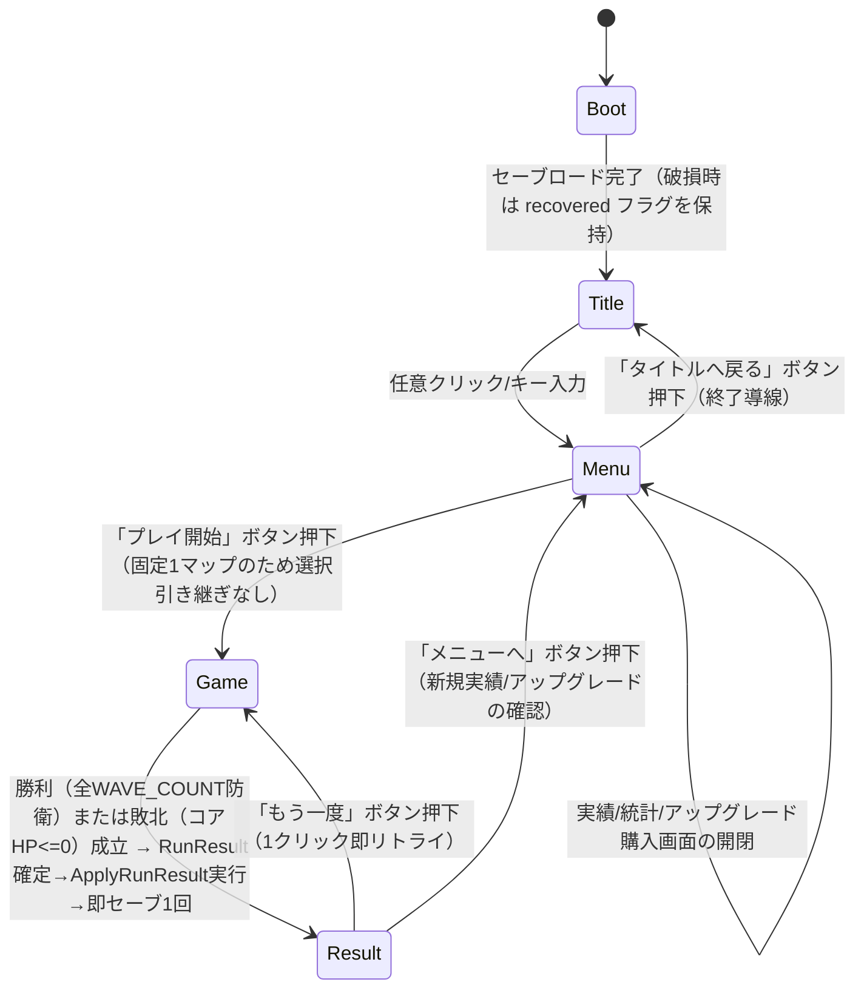

# GDD — Crystal Bastion（仮）

エンジン: unity（Unity 6.3 LTS / URP / C# / Input System — `.claude/docs/tech-stack-unity.md` 準拠）。
参照: `design/brief.md`、`design/concept.md`（ピラー P-01〜P-04）。

## システム一覧

| システム | P-xx | 概要 | 実装先の目安（systems/） |
|---|---|---|---|
| ビルドスポット選択・設置 | P-01 | 入力: ビルドスポットへの左クリック・所持資金・**適用中 UPG-02 割引率**。処理: 空き判定・タワー種別の基礎設置コストへ `(1 - UPG-02割引率)` を乗算した実効コストと所持資金の比較・タワー種別選択。出力: タワー設置イベント（以後移設不可・売却のみ可） | `Assets/Scripts/Systems/BuildSpotSystem.cs` |
| タワー自動攻撃 | P-02, P-03 | 入力: タワー種別/Lv・射程内の敵リスト。処理: 単体高火力（最も進行度が高い敵を単発高ダメージ）と範囲低火力（射程内全体に低ダメージ継続）の2種のみのターゲティング・発射間隔管理。出力: ダメージ適用イベント（**発生源タワー種別を必ず含む** — 撃破帰属ルール節参照）・発射エフェクトトリガー | `Assets/Scripts/Systems/TowerCombatSystem.cs` |
| タワーアップグレード | P-01, P-02 | 入力: 選択中タワー・所持資金・**適用中 UPG-02 割引率**。処理: 役割を変えずLv上限内（Lv3まで）で、各Lvの基礎アップグレードコストへ `(1 - UPG-02割引率)` を乗算した実効コストを消費。出力: タワーステータス更新イベント・残資金 | `Assets/Scripts/Systems/TowerUpgradeSystem.cs` |
| 売却 | P-01 | 入力: 選択中タワーの売却操作。処理: 設置・アップグレード投入額の一部（率は数値表）を資金へ返還しスポットを空きに戻す。出力: 資金更新・スポット状態更新（移設ではなく撤去+再設置前提に限定し P-01 の「一手必中」を保つ） | `Assets/Scripts/Systems/BuildSpotSystem.cs` |
| ウェーブ進行・敵スポーン | P-03 | 入力: 現在ウェーブ番号。処理: 出現テーブル（難易度曲線節）に従い一本道の始点から敵を一定間隔で生成し経路終点へ向け等速移動させる（経路はタワー配置で変化しない）。出力: 敵インスタンス群・ウェーブ予告表示イベント・ゴール到達イベント | `Assets/Scripts/Systems/WaveSpawnSystem.cs` |
| 敵HP・撃破解決 | P-03 | 入力: ダメージ適用イベント（発生源タワー種別込み）。処理: HP減算・0以下で撃破判定。撃破の帰属は最終ダメージを与えたタワー種別で決定（撃破帰属ルール節）。出力: 撃破エフェクト/SFXトリガー・撃破報酬・撃破数カウント加算（総撃破数、および Arc Emitter 帰属分を「AoE撃破数」として分離集計） | `Assets/Scripts/Systems/EnemyHealthSystem.cs` |
| コア防衛・敗北判定 | P-01, P-04 | 入力: 敵のゴール到達イベント。処理: 敵の攻撃力ぶんコアHPを減算。0以下で即座に敗北確定。出力: コアHP更新・敗北イベント | `Assets/Scripts/Systems/CoreDefenseSystem.cs` |
| 資金（ラン内経済） | P-01 | 入力: 撃破報酬・ウェーブクリア報酬・設置/強化/売却によるコスト増減。処理: 残高更新（負値禁止のガード）。出力: 残高 | `Assets/Scripts/Systems/EconomySystem.cs` |
| ウェーブ/勝利判定 | P-01, P-04 | 入力: 全ウェーブの敵消滅（撃破+ゴール到達済み）状態。処理: 最終ウェーブ（WAVE_COUNT）消化かつコアHP>0を検出。出力: 勝利イベント | `Assets/Scripts/Systems/WaveSpawnSystem.cs`（同ファイル内の勝利判定関数） |
| スコア算出 | P-03, P-04 | 入力: ラン終了時点の残コアHP・撃破数・経過秒数。処理: スコア算出式（スコア・進行節）を適用。出力: 最終スコア | `Assets/Scripts/Systems/ScoreSystem.cs` |
| メタ進行（実績・アップグレード・統計） | P-04 | 入力: RunResult（勝敗・残コアHP・撃破数・使用スポット数・AoE撃破数・経過秒数）。処理: ハイスコア/統計更新・実績判定・essence算出・アップグレード効果の反映。出力: 新 SaveData（純粋 reducer、I/O なし） | `Assets/Scripts/Systems/Meta/MetaProgression.cs`（+ `MetaTypes.cs` / `MetaSchema.cs`） |
| 演出フィードバック | P-03 | 入力: 発射/撃破/コア被弾イベント。処理: 対応する VFX・SFX の再生要求を選択（実装コストより派手さ優先）。出力: 演出キュー（実際の再生は Components/Ui 層） | `Assets/Scripts/Systems/FeedbackCueSystem.cs`（キュー選択のみ。再生自体は `Components/`） |

## ゲームフロー

必須シーン集合（contract §11）: `Boot / Title / Menu / Game / Result` の5シーン（`Assets/Scenes/`）。



Esc は Game シーン中のみ一時停止オーバーレイ（再開/設定/タイトルへ戻る）を開く（シーン遷移は伴わない一時停止 UI）。

### Menu 必須要素チェック（contract §11。4要素すべての遷移/表示が上の図と実装に実在すること）

| 必須要素 | 対応する遷移/表示（上の mermaid・実装と一致させる） |
|---|---|
| プレイ開始 | Menu → Game（「プレイ開始」ボタン） |
| アウトゲーム表示（アンロック/実績/統計） | Menu 内オーバーレイ: 実績一覧（ACH-01〜05・進捗）、統計（総ラン数/総勝利数/総撃破数）、所持essenceとUPG-xxのLv・購入UI（アンロックは非採用のため対象なし） |
| 設定（音量・操作表示） | Menu 内オーバーレイ: 音量スライダー（BGM/SFX）、操作説明（左クリック/右クリック/Esc） |
| 終了導線 | Menu → Title（「タイトルへ戻る」ボタン） |

## 操作仕様

| 入力 | 動作 | 補足（長押し/連打/優先度） |
|---|---|---|
| 左クリック（空きビルドスポット） | タワー種別選択メニュー（Bastion Cannon / Arc Emitter）を表示。選択後、資金が設置コスト以上なら即設置・不足ならメニュー内に不足表示のみで設置不可 | ドラッグ操作は無し。同一フレーム内の連打は最初の1回のみ処理（以後は無視） |
| 左クリック（設置済みタワー） | アップグレード/売却パネルを表示。資金が次Lvコスト以上ならアップグレード実行。Lv3到達済みはアップグレード選択肢を非表示 | 長押しは通常クリックと同一扱い（区別しない） |
| 左クリック（メニュー/パネル外の空間） | 表示中のタワー選択メニュー・アップグレード/売却パネルを閉じる（選択解除） | 新規設置クリックと同一フレームで競合した場合は解除を優先し、次のクリックから新規操作を受け付ける |
| 右クリック、または UI の「キャンセル」ボタン | 選択解除（左クリック外部と同じ効果） | 右クリックにコンテキストメニュー等の追加機能は割り当てない |
| Esc | Game シーン中: 一時停止オーバーレイの表示/非表示トグル。Menu/Title/Result 中: 何もしない | 一時停止中はタワー攻撃・敵移動・タイマーを全停止（`Time.timeScale = 0`） |
| マウスホバー | ビルドスポット/タワーのハイライト表示（射程プレビュー円を薄く表示） | 入力処理としては非破壊（状態変更なし）。P-03 の視認性向上のみ |

カメラは固定俯瞰（移動・ズーム操作なし）。全入力は Input System で `Assets/Scripts/Input/` に集約する（tech-stack-unity.md 規約4）。

## 敵・障害物

| 種別 | 行動パターン | 当たった時 | 出現条件 | 対応資産 id |
|---|---|---|---|---|
| Marauder（速い・低HP） | 一本道の始点からゴールまで固定経路を等速前進。索敵・回避・進路変更は行わない（タワー配置は進路でなく火力配分のみを左右する — concept 設計判断） | タワー射程内で継続的にダメージを受ける。HP<=0 で撃破エフェクト/SFX再生・消滅・撃破報酬付与。ゴール到達時はコアHPを `MARAUDER_CORE_DAMAGE` 分減算し自身は消滅（撃破扱いにしない） | WAVE 1 から出現。各ウェーブの構成数・出現間隔は難易度曲線節の表に従う | MDL-03（予定id・assets.md で確定） |
| Warbeast（遅い・高HP） | Marauder と同じ固定経路・等速前進。タンク役として単体高火力タワーの的になりやすい | 同上（`WARBEAST_CORE_DAMAGE` を適用） | WAVE 3 から混成出現。難易度曲線節の表に従う | MDL-04（予定id・assets.md で確定） |

## スコア・進行

- ラン内進行の単位は「ウェーブ番号（1〜WAVE_COUNT）」。各ウェーブはクリア時に `WAVE_CLEAR_GOLD_REWARD` を資金へ加算する。
- 撃破報酬は敵種別ごとに固定額（数値表の `MARAUDER_GOLD_REWARD` / `WARBEAST_GOLD_REWARD`）を即時資金へ加算する（コンボ・倍率は無し — P-02 の「役割の結果がそのまま返る」を単純に保つ）。
- 最終スコアはラン終了時（勝利・敗北いずれも）に1回だけ以下の式で算出し、ハイスコアと比較・更新する:

```
finalScore = round(
    (coreHpRemaining / CORE_HP_MAX) * SCORE_CORE_WEIGHT
  + killCount * SCORE_KILL_WEIGHT
  + max(0, SCORE_TIME_PAR_SEC - clearTimeSec) * SCORE_TIME_WEIGHT
)
```

- `coreHpRemaining` は敗北時は 0 として計算する（コアHP0で敗北確定のため自然に0）。`clearTimeSec` はラン開始からラン終了（勝利成立 or 敗北成立）までの経過秒数。
- 定数（`SCORE_CORE_WEIGHT` 等）の値は数値表を参照。

## 難易度曲線

WAVE_COUNT = 8（固定・調整レンジ 6〜10。brief の「8波目安」をそのまま確定）。決定論的な構成（同一シードで毎回同じ敵構成・出現順）とし、ラン間の差はメタ進行（UPG-xx による初期資金/割引率のみ）が生む（concept 設計判断）。

| 経過（ウェーブ番号） | 変化するパラメータ | 値の変化 |
|---|---|---|
| WAVE 1 | Marauder のみ導入 | Marauder x6、出現間隔 `SPAWN_INTERVAL_BASE` 秒 |
| WAVE 2 | Marauder 増数 | Marauder x8、出現間隔は変化なし |
| WAVE 3 | Warbeast 初出現（混成の開始） | Marauder x6 + Warbeast x2、出現間隔 `SPAWN_INTERVAL_BASE` の90% |
| WAVE 4 | 両種増数 | Marauder x10 + Warbeast x2 |
| WAVE 5 | Warbeast 比率上昇 | Marauder x8 + Warbeast x4、出現間隔80% |
| WAVE 6 | 総数増加・テンポ加速 | Marauder x10 + Warbeast x5、出現間隔75% |
| WAVE 7 | 山場前の高密度 | Marauder x12 + Warbeast x6、出現間隔70% |
| WAVE 8（最終） | 最大規模・最終防衛 | Marauder x14 + Warbeast x8、出現間隔65% |
| ウェーブ間 | 準備フェーズ（建設・強化の猶予） | `WAVE_PREP_SEC` 秒（設置/強化はこの間だけでなく常時可能。予告UIとテンポ確保が目的） |

- 出現間隔（同一ウェーブ内・敵1体ずつのスポーン間隔）は上表の倍率を `SPAWN_INTERVAL_BASE`（数値表）へ掛けて算出する。
- ブリーフの想定セッション長（1ラン約5分）との整合: 8ウェーブ×(準備`WAVE_PREP_SEC`+消化時間)が概ね300秒に収まるよう `WAVE_PREP_SEC` と `SPAWN_INTERVAL_BASE` を初期値で調整済み（数値表の根拠欄参照）。プレイテストで超過する場合は調整レンジ内で短縮する。

## 数値表

| 定数名 | 意味 | 初期値 | 調整レンジ | 根拠 |
|---|---|---|---|---|
| CORE_HP_MAX | コアクリスタルの最大HP | 100 | 80〜140 | 8波×平均到達数体でも即死しない猶予（P-01: 配置ミスの結果が即座に返るが即詰みではない） |
| STARTING_GOLD | ラン開始時の初期資金 | 100 | 80〜150 | タワー1〜2基を初手で設置できる下限 |
| NUM_BUILD_SPOTS | ビルドスポット総数 | 6 | 5〜8 | P-01/P-02: 全スポットを埋めきれない程度の希少性を保ち役割配分の意思決定を強制 |
| WAVE_COUNT | 総ウェーブ数 | 8 | 6〜10 | brief の「8波目安」を確定 |
| WAVE_PREP_SEC | ウェーブ間の準備時間 | 15 秒 | 10〜25 | 予告を見て配置を検討する猶予（P-01） |
| SPAWN_INTERVAL_BASE | 同一ウェーブ内の敵スポーン間隔（基準値） | 1.0 秒 | 0.6〜1.5 | 敵集団として視認できる間隔（P-03） |
| PATH_LENGTH_M | 一本道の全長 | 40 m | 30〜60 | 固定俯瞰1画面に収まりタワー射程設計と整合する長さ |
| BASTION_CANNON_COST | タワーA（単体高火力）設置コスト | 50 | 40〜70 | 初期資金でも1〜2基設置可能 |
| BASTION_CANNON_DAMAGE_LV1 | タワーA Lv1 ダメージ/発 | 25 | 18〜35 | Warbeast（HP90目安）を数発で崩せる火力 |
| BASTION_CANNON_FIRE_INTERVAL | タワーA 発射間隔 | 1.2 秒 | 0.9〜1.5 | 「重い一撃」の役割を速射と差別化（P-02） |
| BASTION_CANNON_RANGE_M | タワーA 射程 | 6 m | 5〜8 | 経路の一区間を広くカバーする単体特化 |
| BASTION_CANNON_UPGRADE_LV2_COST | タワーA Lv1→Lv2 コスト | 40 | 30〜55 | 設置コストよりやや安い強化価格 |
| BASTION_CANNON_DAMAGE_LV2 | タワーA Lv2 ダメージ/発 | 40 | 30〜55 | 段階強化で単体特化を強める（役割変更なし・P-02） |
| BASTION_CANNON_UPGRADE_LV3_COST | タワーA Lv2→Lv3 コスト | 70 | 55〜90 | 最終段階は高コスト |
| BASTION_CANNON_DAMAGE_LV3 | タワーA Lv3 ダメージ/発 | 65 | 50〜85 | 終盤Warbeast複数体に対応できる火力上限 |
| ARC_EMITTER_COST | タワーB（範囲低火力）設置コスト | 40 | 30〜60 | タワーAよりやや安く複数設置を誘導 |
| ARC_EMITTER_DAMAGE_LV1 | タワーB Lv1 ダメージ/tick | 8 | 5〜12 | Marauder（HP30目安）集団を数tickで削る低火力 |
| ARC_EMITTER_TICK_INTERVAL | タワーB tick間隔 | 0.8 秒 | 0.6〜1.0 | 速射で範囲制圧する役割（P-02） |
| ARC_EMITTER_RADIUS_M | タワーB 効果半径 | 3 m | 2.5〜4 | 密集した集団を同時ヒットさせる範囲 |
| ARC_EMITTER_RANGE_M | タワーB 索敵射程 | 4.5 m | 4〜6 | タワーAより短射程で役割差別化 |
| ARC_EMITTER_UPGRADE_LV2_COST | タワーB Lv1→Lv2 コスト | 35 | 25〜50 | — |
| ARC_EMITTER_DAMAGE_LV2 | タワーB Lv2 ダメージ/tick | 14 | 10〜20 | — |
| ARC_EMITTER_UPGRADE_LV3_COST | タワーB Lv2→Lv3 コスト | 60 | 45〜85 | — |
| ARC_EMITTER_DAMAGE_LV3 | タワーB Lv3 ダメージ/tick | 22 | 16〜32 | 終盤高密度ウェーブに対応する範囲火力上限 |
| TOWER_SELL_REFUND_RATE | 売却時の返還率（設置+強化投入額に対する割合） | 0.5 | 0.4〜0.7 | 詰み回避は許すが無償移設と同等の緩さは避ける（P-01） |
| MARAUDER_HP | Marauder HP | 30 | 20〜45 | タワーB数tickまたはタワーA1〜2発で撃破可能 |
| MARAUDER_SPEED_MPS | Marauder 移動速度 | 3.5 m/s | 3〜4.5 | PATH_LENGTH_M を約11秒で走破 |
| MARAUDER_GOLD_REWARD | Marauder 撃破報酬 | 5 | 3〜8 | 低HP・低報酬で数を捌く前提 |
| MARAUDER_CORE_DAMAGE | Marauder ゴール到達時のコアHP減算量 | 1 | 1〜2 | 1体の見逃しが致命傷にならない |
| WARBEAST_HP | Warbeast HP | 90 | 70〜130 | タワーA複数発またはタワーB集中tickを要する重さ |
| WARBEAST_SPEED_MPS | Warbeast 移動速度 | 1.8 m/s | 1.5〜2.5 | PATH_LENGTH_M を約22秒で走破（タンクとして狙いやすい） |
| WARBEAST_GOLD_REWARD | Warbeast 撃破報酬 | 12 | 8〜18 | 高HPに見合う高報酬 |
| WARBEAST_CORE_DAMAGE | Warbeast ゴール到達時のコアHP減算量 | 3 | 2〜5 | 見逃した際の損失を明確に大きくする |
| WAVE_CLEAR_GOLD_REWARD | ウェーブクリア時の追加資金 | 20 | 15〜35 | 次ウェーブへの強化投資原資 |
| SCORE_CORE_WEIGHT | スコア式: コアHP残存の重み | 500 | 400〜700 | 「守り切った盤面」を最重視（P-01） |
| SCORE_KILL_WEIGHT | スコア式: 撃破数1体あたりの重み | 8 | 5〜12 | 撃破の積み上げを反映（P-03） |
| SCORE_TIME_PAR_SEC | スコア式: 基準クリア時間 | 300 秒 | 240〜360 | brief のセッション長目安（約5分）と一致 |
| SCORE_TIME_WEIGHT | スコア式: 基準時間短縮1秒あたりの重み | 2 | 1〜4 | タイムボーナスは副次要素に留める |

## 勝敗条件

- **勝利**: `currentWave > WAVE_COUNT` かつ `coreHp > 0`（全8ウェーブの敵が撃破 or ゴール到達済みで消滅し、コアクリスタルが残存）。判定成立の瞬間、勝利ジングルSFX + コア周辺の勝利エフェクトを再生し、1秒の演出待機後 Result へ遷移。
- **敗北**: いずれかの時点で `coreHp <= 0`（ウェーブ消化中でも即時判定）。判定成立の瞬間、コア崩壊エフェクト+SFXを再生し、1秒の演出待機後 Result へ遷移。
- 勝敗いずれの場合もスコア算出（スコア・進行節）とメタ進行の確定（実績判定・essence加算・ハイスコア/統計更新）を Result 遷移前に実行し、Result シーンでその結果を表示する。

## リスタート

- Result シーンの「もう一度」ボタン（1クリック）で Game シーンへ即座に戻る。
- **リセットされる状態**: コアHP（`CORE_HP_MAX` へ）、資金（`STARTING_GOLD` + 適用中UPG-xx効果分へ）、全ビルドスポットの状態（空きに戻す）、ウェーブ進行（WAVE 1から）、撃破数・経過秒数。
- **引き継ぐ状態**: セーブデータ全体（ハイスコア、ベストタイム、統計、実績解放状況、essence残高、UPG-xxのLv）。UPG-xx の効果（初期資金加算・割引率・essence獲得率）は次ランの初期値計算に反映される。
- Result → Menu の場合も上記リセット内容は同一（Menu → Game で新規ラン開始時に適用）。

## メタ進行（アウトゲーム）

### 採用要素

| 要素 | 採用（必須/選択-採用/選択-非採用） | P-xx | 根拠（1文） |
|---|---|---|---|
| ハイスコア / ベストタイム | 必須 | P-03, P-04 | スコア・進行節の finalScore とクリアタイムを永続記録し「もっと最適化したい」を可視化する |
| 統計 | 必須 | P-04 | 総ラン数・総勝利数・総撃破数の積み上げが「負けても前に進んでいる」実感を支える |
| 通貨（essence） | 選択-採用（UPG-xx の財源。単独要素としては非カウント — DR-GDD 観点6注記） | P-04 | ラン結果から資金化し UPG-xx の購入原資にするための必須の仲介システム |
| アンロック | 選択-非採用 | — | brief のスコープ制約（3Dモデル上限5体・盛らない宣言）で新規タワー/スキン等の解放先コンテンツを追加する余地が無く、ACH-xx+UPG-xxで必須の2要素以上を既に満たすため見送り |
| 実績 | 選択-採用 | P-01〜P-04（下表individually） | 「一手必中」「役割分担」「溶ける実感」「負けても伸びる」の4ピラー全てを個別に裏付ける行為を実績化できる |
| 持ち越しアップグレード | 選択-採用 | P-04 | 敗北しても essence は確定で積み上がり、次ランの初期条件（資金・割引・essence獲得率）を穏やかに強化する（concept 設計判断: 決定論8波の敵側パラメータは弱化しない） |

### ハイスコア / ベストタイム

| 記録軸 | 集計方法（最高値/最短/累計等） | 表示先シーン |
|---|---|---|
| ハイスコア（finalScore） | 最高値を更新（勝敗どちらの結果でも算出・比較） | Result（今回スコアとの比較表示）、Menu（アウトゲーム表示） |
| ベストクリアタイム（clearTimeSec） | 勝利ランのみを対象に最短値を更新（敗北ランは対象外） | Result（勝利時のみ）、Menu（アウトゲーム表示。未記録時は「--」表示） |

### 統計

| 統計項目 | 更新タイミング | 表示先 |
|---|---|---|
| 総プレイ回数（totalRunsPlayed） | ラン終了（勝敗確定）ごとに+1 | Menu（アウトゲーム表示） |
| 総勝利数（totalWins） | 勝利確定ごとに+1 | Menu（アウトゲーム表示） |
| 総撃破数（totalKills、累計） | ラン終了時に今回ラン撃破数を加算 | Menu（アウトゲーム表示）、ACH-03 の判定に使用 |

### 通貨（採用時のみ）

| パラメータ | 初期値 | 調整レンジ | 根拠 | P-xx |
|---|---|---|---|---|
| essenceEarned 算出式基礎額（敗北時） | `ESSENCE_BASE_LOSS = 5` | 3〜8 | 敗北しても最低限は積み上がる（P-04の核） | P-04 |
| essenceEarned 撃破数除数 | `ESSENCE_KILL_DIVISOR = 5`（`floor(killCount / 5)` を加算） | 4〜8 | 撃破数がessenceに反映される | P-04 |
| essenceEarned 勝利ボーナス | `ESSENCE_WIN_BONUS = 15` | 10〜25 | 勝利を明確に優遇しつつ敗北でも0にしない | P-04 |
| 初期所持essence | 0 | 0（固定） | 初回起動時は未所持から開始 | P-04 |

算出式:
```
essenceEarned = round(
    (ESSENCE_BASE_LOSS + floor(killCount / ESSENCE_KILL_DIVISOR) + (isWin ? ESSENCE_WIN_BONUS : 0))
  * (1 + upgEssenceRateLv * UPG03_ESSENCE_RATE_PER_LV)
)
```

### アンロック（採用時のみ）

非採用（上記「採用要素」根拠のとおり）。該当なし。

### 実績（採用時のみ）

| ID (ACH-xx) | 条件（判定式・閾値は調整レンジ併記） | 進捗表示要否 | P-xx |
|---|---|---|---|
| ACH-01 | 初勝利: `totalWins >= 1` | 不要（獲得/未獲得のみ） | P-04 |
| ACH-02 | 完全防衛: 勝利ランで `coreHpRemaining >= CORE_HP_MAX`（コア被弾ゼロで防衛完了） | 不要 | P-01 |
| ACH-03 | 累計撃破: `totalKills >= 100`（80〜150） | 要（現在値/目標値のバーをMenuに表示） | P-03 |
| ACH-04 | 範囲特化: 単一ラン内で Arc Emitter 撃破数（下記「撃破の帰属ルール」で分離集計した AoE撃破数） `>= 20`（15〜30） | 要（当該ラン中はGame内にも簡易表示可、必須ではない） | P-02 |
| ACH-05 | 倹約防衛: 使用ビルドスポット数 `<= 4`（3〜5、`NUM_BUILD_SPOTS=6`中）で勝利 | 不要 | P-01 |

#### 撃破の帰属ルール（ACH-04 / AoE撃破数の判定基盤・DR-GDD iteration1 指摘1 対応）

- 撃破の帰属タワー種別は **final-hit 方式**（貢献度按分は行わない）: 敵の残りHPを 0 以下にした最終ダメージ適用イベントの発生源タワー種別を、その敵の撃破の帰属先とする。
- 同一敵に同一フレームで複数のダメージ適用イベントが到達し、複数が同時にHPを0以下にし得る場合は、`WaveSpawnSystem` が管理する敵インスタンス配列に対するタワー側の処理順（シーン内タワーコンポーネントの登録順=Inspector/ヒエラルキー順）で最初に評価されたイベントを最終ダメージとする（決定論的・実装依存の順序をそのまま採用し、狙って操作可能な要素にはしない）。
- `TowerCombatSystem` の全ダメージ適用イベントは発生源タワー種別（Bastion Cannon / Arc Emitter）を必須フィールドとして持つ。
- `EnemyHealthSystem` は撃破確定時に上記ルールで帰属タワー種別を判定し、**総撃破数**（種別問わず全撃破。ACH-03/スコアの `killCount` はこちら）とは別に、**Arc Emitter 帰属の撃破のみを「AoE撃破数」として単一ラン内で分離カウント**する（ラン開始時0リセット、リスタートでも0に戻る）。AoE撃破数は RunResult（メタ進行システム入力）へ含め、ACH-04 の判定に使う。

### 持ち越しアップグレード（採用時のみ）

| ID (UPG-xx) | 効果 | Lv初期値 | Lv上限 | 1Lvあたり増分（調整レンジ） | P-xx |
|---|---|---|---|---|---|
| UPG-01 | ラン開始時の初期資金（`STARTING_GOLD`）に加算 | 0 | 3 | +15 gold/Lv（10〜25） | P-04 |
| UPG-02 | タワー設置・アップグレードコストの割引率 | 0 | 3 | -3%/Lv（-2%〜-5%） | P-04 |
| UPG-03 | essenceEarned への乗算ボーナス（`UPG03_ESSENCE_RATE_PER_LV`） | 0 | 3 | +8%/Lv（5%〜15%） | P-04 |

- UPG-01/02 は「初期条件（資金・割引）」のみを変え、決定論8波の敵側パラメータ（HP・速度・出現数）を直接弱化する効果は持たせない（concept 設計判断・DR-GDD 矛盾スキャン対象）。
- 全 UPG-xx は essence を消費して Menu 内アウトゲーム表示から購入する（購入コストは `UPG_PURCHASE_COST_PER_LV = 30 essence`、調整レンジ 20〜50、Lvが上がるごとに同額。将来的な逓増は数時間スコープ外としてカット — brief の「盛らない宣言」に整合）。

### セーブデータ方針

| 保存対象 | SaveData のフィールド名 | 初期値（初回起動時） |
|---|---|---|
| セーブバージョン | `saveVersion` | 1 |
| ハイスコア | `highScore` | 0 |
| ベストクリアタイム（秒、未記録は-1） | `bestClearTimeSec` | -1（Menu/Result では「--」表示） |
| 総プレイ回数 | `totalRunsPlayed` | 0 |
| 総勝利数 | `totalWins` | 0 |
| 総撃破数（累計） | `totalKills` | 0 |
| 所持essence | `essence` | 0 |
| UPG-01 Lv | `upgStartingGoldLv` | 0 |
| UPG-02 Lv | `upgTowerDiscountLv` | 0 |
| UPG-03 Lv | `upgEssenceRateLv` | 0 |
| ACH-01 解放済みフラグ | `achFirstVictory` | false |
| ACH-02 解放済みフラグ | `achPerfectDefense` | false |
| ACH-03 解放済みフラグ | `achCenturySlayer` | false |
| ACH-04 解放済みフラグ | `achAoeSpecialist` | false |
| ACH-05 解放済みフラグ | `achFrugalArchitect` | false |
| 直近ロード時の復旧フラグ（セーブ破損からの復旧通知用） | `recovered`（永続化されずロード結果として都度生成。SaveData自体には保存しない） | false |

save_version・破損時挙動（`.bak` 退避＋`[SaveCorruption]` 明示エラーログ＋黙って初期化しない）は `.claude/docs/tech-stack-unity.md`「セーブ / 永続化」節の共通仕様に従う。JsonUtility でのフラット表現を前提に、上記フィールドは全てプリミティブ型（int/float/bool）でネストなしとする。

---

## タワー仕様（追加節・登場エンティティ補足）

<!-- 下流（art-director の assets.md、gameplay-engineer の stories）向けにエンティティ挙動を明記。数値の正本は上記「数値表」。 -->

| タワー | 役割（P-02） | 挙動概要 | 対応資産 id |
|---|---|---|---|
| Bastion Cannon（タワーA） | 単体高火力 | 射程内で最も進行度の高い1体を狙い、`BASTION_CANNON_FIRE_INTERVAL` ごとに単発高ダメージを与える。アップグレードはダメージのみ増加し役割は変わらない | MDL-01（予定id・assets.md で確定） |
| Arc Emitter（タワーB） | 範囲低火力 | `ARC_EMITTER_RANGE_M` 内に敵が1体でもいれば `ARC_EMITTER_TICK_INTERVAL` ごとに `ARC_EMITTER_RADIUS_M` 内の全敵へ低ダメージを与える。アップグレードはダメージのみ増加し役割は変わらない | MDL-02（予定id・assets.md で確定） |

### モーション方式（全 MDL 共通・DR-GDD iteration1 指摘3 / concept iteration2 申し送り#1 対応）

登場する5体（MDL-01〜05）は**全てスケルタルアニメ無し**（Humanoid/Generic Avatar・AnimatorController の配線コストを持たない静的リグ無しメッシュ）とし、動きは全てコード駆動の transform 操作で表現する。数時間スコープと brief のモデル数上限（5体以内）・盛らない宣言に合わせ、Integrate コスト（Avatar生成・AnimatorController配線）を最小化するための確定判断。

| 対象 | モーション表現 | 実装先 |
|---|---|---|
| Bastion Cannon / Arc Emitter（タワー） | 静止設置。発射時のみコードで砲身/エミッタ部分（子Transform）を対象敵方向へ`Quaternion.LookRotation`で回転させ、発射瞬間に軽いリコイル（スケール/位置のショートパンチ演出）をコードでトリガー | `Assets/Scripts/Systems/FeedbackCueSystem.cs`（キュー選択）+ `Assets/Scripts/Components/`（実際の回転・リコイル適用） |
| Marauder / Warbeast（敵） | 経路に沿った位置補間（`Vector3.MoveTowards`、数値表の `*_SPEED_MPS`）による移動と、進行方向への `LookRotation` 追従のみ。歩行を模す簡易上下ボブ（`sin` 波・振幅/周期は演出用のためconfig定数化するが調整レンジ不要の装飾値）をコードで加算。walk/idle クリップは持たない | `Assets/Scripts/Systems/WaveSpawnSystem.cs`（移動）+ `Assets/Scripts/Components/`（向き・ボブ演出） |
| コアクリスタル | 静止。被弾時のみコードでヒットフラッシュ（マテリアルカラー一時変更）とスケールパルスを適用 | `Assets/Scripts/Components/` |

- MDL-01〜05 は全て**リグ無し（`rig_type: none`）**で assets.md に発注する。ANM 資産（アニメーションクリップ）は本作では発注しない（brief のモデル数上限と Integrate コスト最小化を優先）。
- 撃破時の演出（P-03: 溶ける実感）はメッシュのスケルタルアニメではなく、パーティクルVFX＋SFX＋対象メッシュの非表示化（またはディゾルブ用シェーダ演出があれば併用、無ければ即非表示）で表現する。

## コアクリスタル仕様（追加節）

- 見た目の役割: マップ終点に固定設置される防衛対象。HP は `CORE_HP_MAX`。P-01（配置の結果が返ってくる先）・P-04（負けても伸びる防衛網の起点）を象徴するオブジェクト。
- 被弾時、コアHPバーが即座に減少しヒットエフェクト/SFXを再生する（P-03: フィードバックの派手さ優先）。
- 対応資産 id: MDL-05（予定id・assets.md で確定）。
